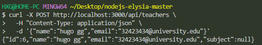
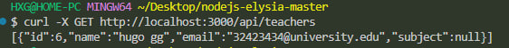
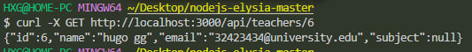
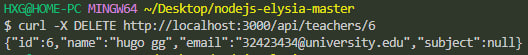

# elysia-test

To install dependencies:

```bash
bun install
```

To run:

```bash
bun run index.ts
```

This project was created using `bun init` in bun v1.1.27. [Bun](https://bun.sh) is a fast all-in-one JavaScript runtime.


# 1. Добавление преподавателя (POST)
### запрос:
    curl -X POST http://localhost:3000/api/teachers \
    -H "Content-Type: application/json" \
    -d '{"name":"hugo gg","email":"32423434@university.edu"}'

  

  ### ответ:
    {"id":6,"name":"hugo gg","email":"32423434@university.edu","subject":null}

# 2 Получение всех преподавателей (GET)
### запрос: 
    curl -X GET http://localhost:3000/api/teachers




### ответ:

    [{"id":6,"name":"hugo gg","email":"32423434@university.edu","subject":null}]

# 3. Получение преподавателя по ID (GET)
### Запрос:
    curl -X GET http://localhost:3000/api/teachers/6




### ответ: 

    {"id":6,"name":"hugo gg","email":"32423434@university.edu","subject":null}


# 4. Удаление преподавателя (DELETE)
### запрос: 
    curl -X DELETE http://localhost:3000/api/teachers/6



### ответ:
    {"id":6,"name":"hugo gg","email":"32423434@university.edu","subject":null}

